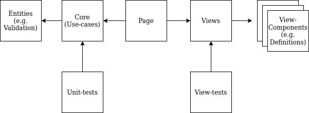

# Developing Secvisogram

This document gives an overview on how to develop Secvisogram, the general technical and architectural design decisions and how to deploy for production.

<!-- TOC depthFrom:2 depthTo:3 insertAnchor:true -->

- [Prerequisites & Development Environment](#prerequisites--development-environment)
- [Secvisogram Architecture & Design](#secvisogram-architecture--design)
  - [Overview Diagram](#overview-diagram)
  - [Secvisogram Components](#secvisogram-components)
- [Technology Stack & Libraries](#technology-stack--libraries)
  - [Core Stack & Technology](#core-stack--technology)
  - [Frameworks & Libraries](#frameworks--libraries)
- [Building Secvisogram](#building-secvisogram)
- [Building & Deploying Secvisogram into Production](#building--deploying-secvisogram-into-production)
  - [Create and Building a release](#create-and-building-a-release)
  - [Deploy to production using nginx](#deploy-to-production-using-nginx)
- [Secvisogram folder structure](#secvisogram-folder-structure)
- [Technical Design](#technical-design)
  - [Form Editor](#form-editor)
  - [Navigation](#navigation)
  - [Validation](#validation)
  - [Sanitizing](#sanitizing)
  - [Data Model](#data-model)
- [Debugging & Testing Secvisogram](#debugging--testing-secvisogram)
  - [Unit Tests](#unit-tests)
  - [View-Tests](#view-tests)
- [CLI](#cli)

<!-- /TOC -->

**Note:** Please also refer to [`PREVIEW-TEMPLATING.md`](PREVIEW-TEMPLATING.md) and [`SECURITY-CONSIDERATIONS.md`](SECURITY-CONSIDERATIONS.md) while developing Secvisogram.

<a id="markdown-prerequisites--development-environment" name="prerequisites--development-environment"></a>

## Prerequisites & Development Environment

- Git
- VSCode
- Node.js (version 16 LTS)
- Firefox stable

Secvisogram recommends using Visual Studio Code as the source code IDE. A `.vscode`-profile is included in this project. It lists recommended extensions, improving the development experience.

<a id="markdown-secvisogram-architecture--design" name="secvisogram-architecture--design"></a>

## Secvisogram Architecture & Design

<a id="markdown-overview-diagram" name="overview-diagram"></a>

### Overview Diagram



<a id="markdown-secvisogram-components" name="secvisogram-components"></a>

### Secvisogram Components

**Entities**:
This module exports the entities of the core. Entities are classes that contain logic applied in multiple use-cases.

**Core**:
Logic that can be abstracted without UI interaction should be placed here to be tested independently. Ideally, this _facade_ exports one method for each use-case of the application.

**Page**:
The page connects the view to the core and maintains the state of the communication.

**View**:
The view is a react-component which defines the main layout of the application.

**View-Components**:
View-components are react-components which provide the actual content for the application.

<a id="markdown-technology-stack--libraries" name="technology-stack--libraries"></a>

## Technology Stack & Libraries

<a id="markdown-core-stack--technology" name="core-stack--technology"></a>

### Core Stack & Technology

**React:**
React is used to implement the views. This JavaScript library is suitable for mapping data structures to the DOM in the browser and keeping it synchronized when the structure changes. In doing so, it offers an easily customizable template language. In addition, React prevents the accidental insertion of executable code in the DOM, thus offering basic protection against cross-site scripting.

**Typescript:**
Typescript is used to type and document the source code. It is not used as the language, but rather as a static type-checker only. Types are declared using [Javascript with embedded Typescript source-code comments](https://www.typescriptlang.org/docs/handbook/jsdoc-supported-types.html). This keeps the overall toolchain clean and simple.

**Tailwind CSS:**
Tailwind-CSS is a CSS-Framework and library of CSS-classes to be reused across components to keep them adaptable and yet themeable.

<a id="markdown-frameworks--libraries" name="frameworks--libraries"></a>

### Frameworks & Libraries

| Domain        | Package        | Description & Justification                                                                                                                               |
| ------------- |----------------|-----------------------------------------------------------------------------------------------------------------------------------------------------------|
| Build         | Webpack        | Bundles the source-code and coordinates the build-pipeline with transpilation-tools like postcss and babel                                                |
|               | npm            | Is the package-manager which is used to install dependencies and update or remove them                                                                    |
|               | Dependabot     | Automated dependency updates. See [https://dependabot.com/](https://dependabot.com/)                                                                      |
|               | postcss        | Used to compile tailwindcss stylesheet. See [https://postcss.org/](https://postcss.org/)                                                                  |
|               | babel          | JavaScript transcompiler to convert ECMAScript ES6+ code into older JavaScript. See [https://babeljs.io/](https://babeljs.io/)                            |
| Linting       | eslint         | Lints the source-code for its quality and accordance to configured rules                                                                                  |
| Styling       | tailwind       | A utility-first CSS framework. See [https://tailwindcss.com/](https://tailwindcss.com/)                                                                   |
|               | fontawesome    | Font-based icons set                                                                                                                                      |
| IDE           | VS Code        | De facto standard IDE for web development. See [https://code.visualstudio.com/](https://code.visualstudio.com/)                                           |
| Codestyle     | Prettier       | An opinionated code formatter to enforce a consistent coding-style. See [https://prettier.io/](https://prettier.io/)                                      |
| Typechecking  | Typescript     | ES with TS annotations. See [Typescript JSDoc supported types](https://www.typescriptlang.org/docs/handbook/jsdoc-supported-types.html)                   |
| UI            | React          | A JavaScript library for building user interfaces. See [https://reactjs.org/](https://reactjs.org/)                                                       |
|               | Reach-UI       | Reach-UI is library of primitive components to build accessible user-interfaces. See [https://reach.tech/](https://reach.tech/)                           |
| Validation    | AJV            | Performs the JSON Schema validation according to the CSAF specification. See [AJV](https://github.com/ajv-validator/ajv)                                  |
| HTML-Template | mustache       | Logic-less templates. See [mustache](https://github.com/janl/mustache.js)                                                                                 |
| Testing       | electron-mocha | Mocha testing in Electron. See [electron-mocha](https://github.com/jprichardson/electron-mocha)                                                           |
|               | mocha          | Mocha is a feature-rich JavaScript test framework. See [https://mochajs.org/](https://mochajs.org/)                                                       |
| Parsing       | xml2js         | XML-parser. See [xml2js](https://github.com/Leonidas-from-XIV/node-xml2js)                                                                                |
|               | json-pointer   | Some utilities for JSON pointers described by RFC 6901. See [json-pointer](https://github.com/manuelstofer/json-pointer)                                  |
| CLI           | yargs          | Yargs helps you build interactive command line tools. See [yargs](https://github.com/yargs/yargs)                                                         |
| JSON-Editor   | monaco editor  | monaco is an embeddable code editor written in JavaScript. See [https://github.com/microsoft/monaco-editor/](https://github.com/microsoft/monaco-editor/) |

<a id="markdown-building-secvisogram" name="building-secvisogram"></a>

## Building Secvisogram

| Command         | Purpose                                                             |
| --------------- | ------------------------------------------------------------------- |
| `npm run dev`   | Starts the development server                                       |
| `npm test`      | Runs typecheck, the linter and the test suite                       |
| `npm run build` | Builds the application as a static asset and places it into `dist/` |

<a id="markdown-building--deploying-secvisogram-into-production" name="building--deploying-secvisogram-into-production"></a>

## Building & Deploying Secvisogram into Production

<a id="markdown-create-and-building-a-release" name="create-and-building-a-release"></a>

### Create and Building a release

To provide a production release of Secvisogram, follow the following steps:

- Run `npm run build`
- Deploy the content of the `app/dist` folder to a webserver
- Configure TLS and HTTP headers according to the template (see nginx)

<a id="markdown-deploy-to-production-using-nginx" name="deploy-to-production-using-nginx"></a>

### Deploy to production using nginx

Below you'll find an example configuration for hosting Secvisogram in a production environment. The example uses TLS and HTTP header pragmas like `Strict-Transport-Security`, `Content-Security-Policy`, `X-Frame-Options`, `X-Content-Type-Options`, `Referrer-Policy` and `Permissions-Policy` security hardening:

    add_header Strict-Transport-Security "max-age=31536000" always;
    add_header X-Content-Type-Options nosniff;
    add_header X-Frame-Options DENY;
    add_header Content-Security-Policy "default-src 'self'; script-src 'self' 'unsafe-eval' https: blob: ; style-src 'self' 'unsafe-inline' unpkg.com; img-src 'self' https: data: blob: ; media-src 'none'; connect-src 'none'; ";
    add_header Referrer-Policy no-referrer;
    add_header Permissions-Policy "geolocation=(), camera=(), fullscreen=*, usb=(), payment=(), microphone=(), gyroscope=(), accelerometer=()";

#### Full nginx configuration example

**File: `/etc/nginx/site-available/secvisogram.conf`**

```
##
# You should look at the following URL's in order to grasp a solid understanding
# of Nginx configuration files in order to fully unleash the power of Nginx.
# https://www.nginx.com/resources/wiki/start/
# https://www.nginx.com/resources/wiki/start/topics/tutorials/config_pitfalls/
# https://wiki.debian.org/Nginx/DirectoryStructure
##

# HTTP server configuration
server {
	listen 80 default_server;
	listen [::]:80 default_server;

	server_name _;

	return 301 https://$host$request_uri;
}

# HTTPS Server
server {
	listen 443 ssl http2;
	listen [::]:443 ssl http2;

	include /etc/nginx/snippets/ssl-secvisogram.conf;
	root /var/www/secvisogram.de;

	# Add index.php to the list if you are using PHP
	index index.html index.htm;

	server_name secvisogram.de;

	location / {
		# First attempt to serve request as file, then
		# as directory, then fall back to displaying a 404.
		try_files $uri $uri/ =404;
	}
}
```

**TLS Configuration parameters: `/etc/nginx/snippets/ssl-secvisogram.conf`**

```
# Certificates used
ssl_certificate /etc/letsencrypt/secvisogram.de/cert.pem;
ssl_certificate_key /etc/letsencrypt/secvisogram.de/key.pem;

# This should be ca.pem (certificate with the additional intermediate certificate)
# See here: https://certbot.eff.org/docs/using.html
ssl_trusted_certificate /etc/letsencrypt/secvisogram.de/ca.pem;

# Diffie-Hellman parameter, recommended 4096 bits
ssl_dhparam /etc/nginx/dhparams/dhparams.pem;

# Not using TLSv1 will break:
# Android <= 4.4.40
# IE <= 10
# IE mobile <=10
# Removing TLSv1.1 breaks nothing else!
# TLSv1.3 is not supported by most clients, but it should be enabled.
ssl_protocols TLSv1.2 TLSv1.3;

# Cipher suite from https://cipherli.st/
# Max. security, but lower compatibility
ssl_ciphers 'TLS-CHACHA20-POLY1305-SHA256:TLS-AES-256-GCM-SHA384:ECDHE-ECDSA-CHACHA20-POLY1305:ECDHE-RSA-CHACHA20-POLY1305:ECDHE-RSA-AES256-GCM-SHA512:DHE-RSA-AES256-GCM-SHA512:ECDHE-RSA-AES256-GCM-SHA384:DHE-RSA-AES256-GCM-SHA384';

# Cipher suite from https://wiki.mozilla.org/Security/Server_Side_TLS
#ssl_ciphers 'ECDHE-ECDSA-AES256-GCM-SHA384:ECDHE-RSA-AES256-GCM-SHA384:ECDHE-ECDSA-CHACHA20-POLY1305:ECDHE-RSA-CHACHA20-POLY1305:ECDHE-ECDSA-AES128-GCM-SHA256:ECDHE-RSA-AES128-GCM-SHA256:ECDHE-ECDSA-AES256-SHA384:ECDHE-RSA-AES256-SHA384:ECDHE-ECDSA-AES128-SHA256:ECDHE-RSA-AES128-SHA256';

# (Modern) cipher suite from https://mozilla.github.io/server-side-tls/ssl-config-generator/
#ssl_ciphers 'ECDHE-ECDSA-AES256-GCM-SHA384:ECDHE-RSA-AES256-GCM-SHA384:ECDHE-ECDSA-CHACHA20-POLY1305:ECDHE-RSA-CHACHA20-POLY1305:ECDHE-ECDSA-AES128-GCM-SHA256:ECDHE-RSA-AES128-GCM-SHA256:ECDHE-ECDSA-AES256-SHA384:ECDHE-RSA-AES256-SHA384:ECDHE-ECDSA-AES128-SHA256:ECDHE-RSA-AES128-SHA256';

# Use multiple curves.
ssl_ecdh_curve secp521r1:secp384r1;

# Server should determine the ciphers, not the client
ssl_prefer_server_ciphers on;

# OCSP Stapling
# fetch OCSP records from URL in ssl_certificate and cache them
ssl_stapling on;
ssl_stapling_verify on;
resolver 8.8.8.8 8.8.4.4;

# SSL session handling
ssl_session_timeout 24h;
ssl_session_cache shared:SSL:50m;
ssl_session_tickets off;

# HSTS Header
add_header Strict-Transport-Security "max-age=31536000" always;

# Security Hardening Headers
add_header X-Content-Type-Options nosniff;
add_header X-Frame-Options DENY;
add_header Content-Security-Policy "default-src 'self'; script-src 'self' 'unsafe-eval' https: blob: ; style-src 'self' 'unsafe-inline' unpkg.com; img-src 'self' https: data: blob: ; media-src 'none'; connect-src 'none'; ";
add_header Referrer-Policy no-referrer;
add_header Permissions-Policy "geolocation=(), camera=(), fullscreen=*, usb=(), payment=(), microphone=(), gyroscope=(), accelerometer=()";
```

<a id="markdown-secvisogram-folder-structure" name="secvisogram-folder-structure"></a>

## Secvisogram folder structure

| Folder             | description                                  |
| ------------------ | -------------------------------------------- |
| `app/dist`         | The output of the build-command              |
| `app/lib`          | Source code                                  |
| `app/node_modules` | npm dependencies of the app                  |
| `app/scripts`      | Various scripts used by npm-scripts          |
| `app/seeds`        | Sample-files                                 |
| `app/tests`        | Unit-tests                                   |
| `app/vendor`       | Dependencies which aren't packaged using npm |
| `app/viewTests`    | View-tests                                   |

Source files may only access folders that have the same name as themselves and are located at the same file level, e.g.
usage of `app/lib/shared/Core/entities/DocumentEntity.js` from within `app/lib/shared/Core.js` is only allowed when importing `app/lib/shared/Core/entities.js`.

Exceptions are the so-called "shared" folders. They may be used if they are located on the same or higher file level, e.g. usage of `app/lib/shared/Core.js` from within `app/lib/SecvisogramPage.js` is allowed because it is contained in a "shared" folder.

<a id="markdown-technical-design" name="technical-design"></a>

## Technical Design

<a id="markdown-form-editor" name="form-editor"></a>

### Form Editor

The "Form Editor" tab represents the structure of the JSON schema. It uses container components to represent objects and arrays, and attribute components to represent values. Missing attributes are shown as "Add ..." buttons, which create the respective attribute using its `defaultValue`-function.

New attributes can be added by instantiating a suitable attribute component (e.g. `app/lib/SecvisogramPage/View/EditorTab/shared/TextAttribute.js`).

<a id="markdown-navigation" name="navigation"></a>

### Navigation

The various parts of the application are accessible using the tabs. The state indicating which tab is active is stored in the react-state in `app/lib/SecvisogramPage.js`. Navigation is only disabled if a parsing error occurs in `app/lib/SecvisogramPage/View/JsonEditorTab.js`.

<a id="markdown-validation" name="validation"></a>

### Validation

The application uses two validation patterns: The fast HTML5 validation; and the validation according to the JSON schema, which kicks in either 300ms after editing the document or when changing the tab. The status of the validation is shown in the "Form Editor" tab, the "JSON Editor" tab and the "Preview" tab.

<a id="markdown-sanitizing" name="sanitizing"></a>

### Sanitizing

The "CSAF Document" tab uses an algorithm to remove elements which are either invalid, empty or null (see `app/lib/shared/Core/entities/DocumentEntity.js`) and shows the removed paths.

<a id="markdown-data-model" name="data-model"></a>

### Data Model

The application state is maintained in the `app/lib/SecvisogramPage.js`. It contains the state which is needed to coordinate the communication with the `app/lib/shared/Core.js`. The editor state is maintained in the `app/lib/SecvisogramPage/View.js`. It contains the state of the current editing status of the document.

<a id="markdown-debugging--testing-secvisogram" name="debugging--testing-secvisogram"></a>

## Debugging & Testing Secvisogram

<a id="markdown-unit-tests" name="unit-tests"></a>

### Unit Tests

Unit tests account for the logic behind the `Core` component and are written using mocha.

You can run them from CLI via `npm test`. Alternatively, you can open http://localhost:8080/tests.html in your browser, which provides you with the ability to run specific tests only.

These are located in the folder `/app/tests`.

<a id="markdown-view-tests" name="view-tests"></a>

### View-Tests

View-tests are a concept used to test and design the view and its view-components independently of the _business logic_. To add a view-test for the view, modify the file `app/viewTests/shared/suites/SecvisogramPage.js` and add your test to the `tests` array.

Once you have started the system as described above, you can view the tests at the following URL:

http://localhost:8080/view-tests.html

On this page, there is a drop-down menu in the footer that can be used to select tests.

<a id="markdown-cli" name="cli"></a>

## CLI

The project includes a convenient cli for various scripts. It resides in the folder `bin/`.

Usage: `node cli.js --help`
