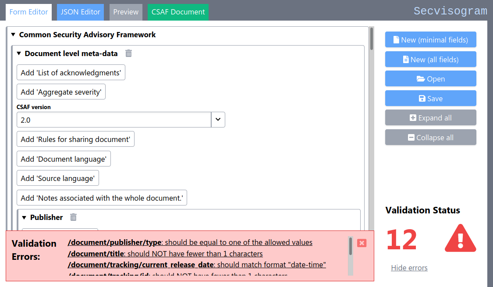

# BSI Secvisogram CSAF 2.0 / 2.1 Web Editor

<!-- TOC depthfrom:2 depthto:3 -->

- [About The Project](#about-the-project)
- [Getting started](#getting-started)
  - [Deploying to Production](#deploying-to-production)
  - [Configure keybindings](#configure-keybindings)
- [How to use](#how-to-use)
  - [Basic concepts](#basic-concepts)
  - [Form Editor](#form-editor)
  - [JSON Editor](#json-editor)
  - [Preview HTML view](#preview-html-view)
  - [CSAF Document JSON view](#csaf-document-json-view)
  - [Templates](#templates)
- [Documentation](#documentation)
- [Contributing](#contributing)
  - [Developer Guide, Architecture and Technical Design](#developer-guide-architecture-and-technical-design)
  - [Custom Preview Templates](#custom-preview-templates)
  - [Security Considerations](#security-considerations)

<!-- /TOC -->

## About The Project

[Secvisogram](https://secvisogram.github.io) is a tool for creating and editing advisories in [CSAF](https://docs.oasis-open.org/csaf/csaf/v2.0/csaf-v2.0.html) [format](https://docs.oasis-open.org/csaf/csaf/v2.0/csaf_json_schema.json).

Secvisogram is inspired by the project [Vulnogram](https://vulnogram.github.io/) - "a tool for creating and editing CVE information in CVE JSON format". Both names share the same Greek suffix '-gram' which is used for denoting something written or recorded in a particular way.
Vulnerability-related information is often not enough - mostly, only the remediation information enables the end user to act efficiently in responding to these concerns. This information is usually conveyed in **Security Advisories**. Therefore, the first part of the name Secvisogram abbreviates the words _Security Advisory_.

Secvisogram aims to make it easier for vendors and other security advisory issuing parties to record the advisory details in the CSAF format.



[(back to top)](#bsi-secvisogram-csaf-20-web-editor)

## Getting started

Assure that you have **Node 20 (LTS) and npm 9 or newer** installed.
[Nodesource](https://github.com/nodesource/distributions/blob/master/README.md) provides binary distributions for various Linux distributions.

      $ node --version ; npm --version
      v20.9.0
      9.9.2

Check out the repository and navigate to the working directory.

    git clone git@github.com:secvisogram/secvisogram.git
    cd secvisogram

Afterwards, the npm dependencies need to be installed.

    npm ci

Now you can start a development server as follows:

    npm run dev

The application is now running and accessible at http://localhost:8080. Use the `--port` argument for alternative ports, e.g. `npm run dev --port=8081`.

You can configure the application by providing a json config under the
following path `.well-known/appspecific/de.bsi.secvisogram.json`.
During development this file has to be in `app/public/.well-known/appspecific`.
This is only needed when you are using secvisogram in combination with the
[CSAF CMS Server](https://github.com/secvisogram/csaf-cms-backend). If no
config is available Secvisogram will fall back to the standalone mode which is
the same as `"loginAvailable": false`.

```json
{
  "loginAvailable": true,
  "loginUrl": "/oauth2/sign_in?rd=http%3A%2F%2Flocalhost%3A8080",
  "logoutUrl": "/oauth2/sign_out?rd=http%3A%2F%2Flocalhost%3A8080",
  "userInfoUrl": "/oauth2/userinfo",
  "validatorUrl": "http://localhost:8082"
}
```

[(back to top)](#bsi-secvisogram-csaf-20-web-editor)

### Deploying to Production

Please refer to [`DEVELOPMENT.md`](DEVELOPMENT.md) for a detailed description on how to build and deploy Secvisogram in production.

### Configure keybindings

The following hotkeys are available by default:

| shortcut         | effect                                 | comment                                   |
| ---------------- | -------------------------------------- | ----------------------------------------- |
| CTRL + O         | New / Open                             | Opens dialog                              |
| CTRL + S         | Save                                   | Opens dialog                              |
| CTRL + ALT + V   | Validate                               |                                           |
| CTRL + ALT + E   | Open export dialog                     |                                           |
| CTRL + E         | Open export dialog                     | `CSAF json (stripped)` preselected        |
| CTRL + SHIFT + E | Open export dialog                     | `CSAF json` preselected                   |
| CTRL + P         | Open export dialog                     | `HTML` preselected                        |
| CTRL + ALT + P   | Open export dialog                     | `PDF` preselected                         |
| CTRL + 1         | Switch to `FormEditor` tab             |                                           |
| CTRL + 2         | Switch to `JsonEditor` tab             |                                           |
| CTRL + 3         | Switch to `Preview` tab                |                                           |
| CTRL + 4         | Switch to `CSAF Document` tab          |                                           |
| CTRL + SHIFT + 1 | Select relevance level "mandatory"     | Only in `FormEditor` tab                  |
| CTRL + SHIFT + 2 | Select relevance level "best practice" | Only in `FormEditor` tab                  |
| CTRL + SHIFT + 3 | Select relevance level "want to have"  | Only in `FormEditor` tab                  |
| CTRL + SHIFT + 4 | Select relevance level "nice to have"  | Only in `FormEditor` tab                  |
| CTRL + SHIFT + 5 | Select relevance level "optional"      | Only in `FormEditor` tab                  |
| f8               | Jump to next error                     | `f8` is the fixed key in the `JsonEditor` |

These can be overwritten if needed by providing an alternative keybinding in
`.well-known/appspecific/de.bsi.secvisogram.json`.
Possible keynames are defined in: [react-hotkeys](https://github.com/jaywcjlove/react-hotkeys#keyname)

```json
{
  ...,
  "keyBindings": {
    "keyNew": "ctrl+o",
    "keySave": "ctrl+s"
  }
}
```

The JSON Editor View has additional keybindings available. To get an
overview please press F1. Hint: The list is scroll and searchable.

## How to use

### Basic concepts

Similar to the Vulnogram model, the web application consists of various tabs that represent the individual views. These are represented as an HTML page which loads its data from a local browser storage using JavaScript.

To start a new document after saving, click the "New" button. Alternatively, click the "Open" button to select and load a local file.

When leaving a view without saving, e.g. reloading the application, a warning is displayed, and the user must confirm prior to leaving the page.

The `document/tracking/engine` data of new documents will be prefilled with `name` and `version` of Secvisogram.
When running with the [CSAF CMS Server](https://github.com/secvisogram/csaf-cms-backend), the backend will manage these fields along with the tracking id, and revision history.

Some fields allow the usage of markdown to format text.
Further information can be found in the [Markdown Guide](MARKDOWN-GUIDE.md)

[(back to top)](#bsi-secvisogram-csaf-20-web-editor)

### Form Editor

The _Form Editor_ view is an HTML form with live input validation. Additionally, the CSAF JSON Schema checks the following constraints:

- Language fields in the form are checked for plausibility against the values from the IANA database
- The consistency of CVSS string and accompanying fields is checked
- The consistency of the CWE ID and description is checked

CVSS 3 input fields are completed with the data from a possibly copied vector string and their values are recalculated. This gives the user an elegant way to use a possibly existing and copied CVSS 2.0 vector and to partially adjust the values.

A special input field is the "CWE" attribute. Here you can search the CWE catalog (XML file) by entering a value in the "id" or "name" field. For this purpose, a list with the first ten entries matching the input opens under the respective input field, from which a suitable entry can be selected and accepted.

Input errors are displayed directly alongside the respective form field. Issue counters and symbols on the top right indicate the current validation status. Clicking on this indicator reveals the sidebar with all validation issues and allows to inspect and directly jump to the respective fields.

_Opening & Saving Files_
You can open and save your CSAF JSON document at any time using the respective _Open_ and _Save_ buttons. If your document fails the validation checks, a confirmation dialog will appear.

The _CSAF Document_ tab offers functionality to extract the standard-valid subset of your current document.

When running with the [CSAF CMS Server](https://github.com/secvisogram/csaf-cms-backend), saving documents on the server and loading documents from the server is also possible for logged-in users. These users will see the corresponding `CSAF Documents` Tab on the top right.

_Identifying & Solving Validation issues_
Opening the error view in the sidebar will reveal a linked list of validation issues. Here you can click on any validation issue and directly jump to the affected form elements.

The Form Editor's interface and behavior can be configured by adjusting field [metadata](app/scripts/importUiMetaData/metaData.js).
For more detail, see the corresponding [readme](app/scripts/importUiMetaData/README.md).

[(back to top)](#bsi-secvisogram-csaf-20-web-editor)

### JSON Editor

The _JSON Editor_ view uses the Monaco editor to edit the JSON representation of the current CSAF document. Please note that only valid JSON content is accepted for further processing.

Hovering over a field will display validation issues. You can also click on errors in the sidebar to jump to the affected elements.
Setting the conent displayed in the sidebar is also possible by right-clicking on a field and setting the sidebar context.

Note that multiline strings are not supported in JSON value fields and will break this navigation. To add line breaks type `\n` instead.

[(back to top)](#bsi-secvisogram-csaf-20-web-editor)

### Preview (HTML view)

This view does not include any editing functionality. It displays a rendered HTML template view of the current CSAF document as shown in the editor views.

Use the toggle button to switch between the Rendered web view and the HTML source view. You can export this HTML document as a standalone HTML document or rendered PDF by selecting the matching option in the export dialog.

[(back to top)](#bsi-secvisogram-csaf-20-web-editor)

### CSAF Document (JSON view)

This view does not include any editing functionality. It **always displays the valid subset of your current CSAF document** by removing any invalid and/or empty CSAF document elements.

You can use this view and the embedded _Export CSAF_ button to always quickly extract the standard-valid subset of your current CSAF document.

[(back to top)](#bsi-secvisogram-csaf-20-web-editor)

### Templates

Secvisogram provides some very basic templates. You can use your own templates by saving them as JSON files on your filesystem and load using the "Upload from filesystem" in the "Create new document" dialog of the editor.

## Documentation

The documentation on CSAF documents lives in the [secvisogram-documentation](https://github.com/secvisogram/secvisogram-documentation/)
repository and is integrated with git-subtree. To update the documentation you can use the following command:

    git subtree pull --prefix docs https://github.com/secvisogram/secvisogram-documentation.git main --squash

[(back to top)](#bsi-secvisogram-csaf-20-web-editor)

## Contributing

Please refer to [`CONTRIBUTING.md`](CONTRIBUTING.md) for details about how to contribute to the development of [Secvisogram](https://github.com/secvisogram/secvisogram).

### Developer Guide, Architecture and Technical Design

The [`DEVELOPMENT.md`](DEVELOPMENT.md) document gives an overall introduction on how to get started with developing Secvisogram as well as an overview on the architecture, libraries used and technical design of Secvisogram.

[(back to top)](#bsi-secvisogram-csaf-20-web-editor)

### Custom Preview Templates

It's possible to change and provide custom Preview Templates. Please refer to [`PREVIEW-TEMPLATING.md`](PREVIEW-TEMPLATING.md) for detailed instructions on how to create, modify and deploy Secvisogram with custom templates.

[(back to top)](#bsi-secvisogram-csaf-20-web-editor)

### Security Considerations

Please refer to [`SECURITY-CONSIDERATIONS.md`](SECURITY-CONSIDERATIONS.md) for details about how Secvisogram addresses the [OWASP Top 10 Web Application Security Risks](https://owasp.org/www-project-top-ten/).

[(back to top)](#bsi-secvisogram-csaf-20-web-editor)
